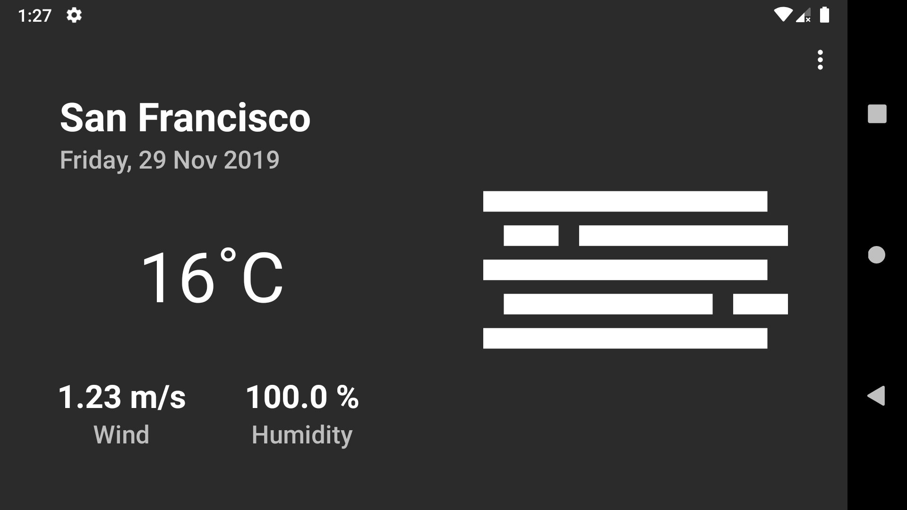
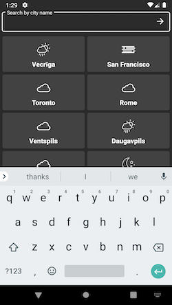

# Weather App

Simple weather application backed by OpenWeatherMap API.

Uses SVG icons from companion repo [here](https://github.com/sashjakk/weather-app-icons)

## Build

1. Create gradle.properties in project app folder
2. Provide your OpenWeatherMap API key

or invoke this in terminal:

```
echo openWeatherApiKey=<YOUR-KEY> > app/gradle.properties
```

3. Build via gradle

```
./gradlew clean build
```

## Screenshots



